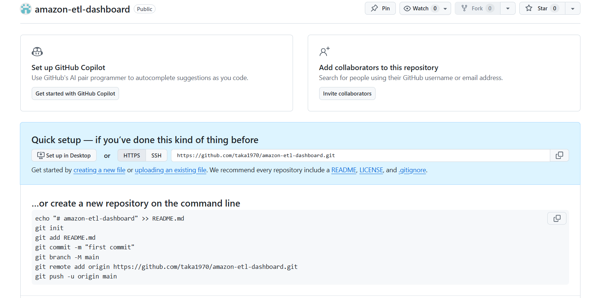

📦 Amazon Price Tracker & ETL Dashboard
A fully automated ETL pipeline + analytics dashboard for tracking Amazon product prices, cleaning messy data, and visualizing trends.
Designed for real‑world reliability, automation, and production‑ready Python workflows.

🚀 Features
Automated ETL pipeline (Extract → Transform → Load)

Daily price tracking with historical storage

Data quality checks (missing values, anomalies, duplicates)

Interactive dashboard built with Streamlit

SQLite database for lightweight persistence

Modular Python architecture (etl / load / quality / dashboard)

Error logging & monitoring

🧩 Tech Stack
Python 3.10+

Streamlit (interactive dashboard)

Requests / BeautifulSoup (web scraping)

Pandas (data cleaning & transformation)

SQLite (local database)

Cron / Task Scheduler (automation)

📁 Project Structure
コード
amazon-etl-dashboard/
│
├── etl/               # Extract & transform logic
├── dashboard/         # Streamlit UI
├── db/                # SQLite database
├── images/            # Screenshots & assets
├── scheduler.py       # Automation entrypoint
├── load.py            # Load to DB
├── quality.py         # Data validation
└── README.md
🔄 ETL Flow
Extract product data from Amazon

Validate & clean messy real‑world HTML

Transform into structured records

Load into SQLite

Visualize trends in Streamlit dashboard

🧪 Skills Demonstrated
This project shows my ability to:

Design reliable ETL pipelines

Work with real‑world messy data

Build production‑ready Python applications

Create automation scripts

Develop internal dashboards

Build data collection bots

Deliver business intelligence mini‑systems

▶️ How to Run
1. Install dependencies
コード
pip install -r requirements.txt
2. Run ETL pipeline
コード
python scheduler.py
3. Launch dashboard
コード
streamlit run dashboard/app.py
🌍 Use Cases
Price monitoring tools

Competitor analysis

E‑commerce intelligence

## 🖥️ Dashboard Screenshot

Internal BI dashboards

Automated reporting systems

📬 Contact
Takayuki Kabata — Python Developer (Osaka, Japan)  
Portfolio-ready project for international freelance work.
